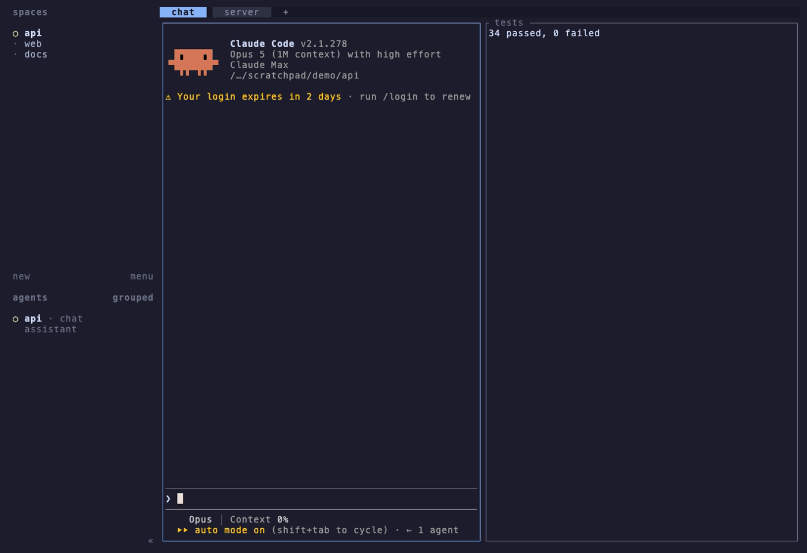

# herdr-pinpoint

[](../LICENSE)

-informational)


<p align="center">
  <a href="#установка">установка</a> · <a href="#клавиши">клавиши</a> · <a href="#что-вводится">что вводится</a> · <a href="#настройка">настройка</a>
</p>

Общаться между pane в Herdr — круто, но замечали, как долго приходится
описывать цель? Особенно если она в другом Space.

Размытые цели стоят дважды: ваши токены на описание и токены агента на
поиск. Этот попап убирает и то, и другое.

> Три секунды — всё, что нужно, чтобы назвать цель; быстрее, чем набрать её
> описание.



- **Три связанные колонки** — пространства, их вкладки и pane вкладок, всегда
  один путь слева направо.
- **Быстрые клавиши** — `1`–`9` в активной колонке; два нажатия достают любой
  pane первой страницы.
- **Поиск по всему дереву** — `/` сопоставляет весь путь `space / tab / pane`
  и подсвечивает найденное.
- **Подтверждение на любом уровне** — `Enter` на пространстве отправляет
  пространство, на pane — pane.
- **Начинает там, где вы** — курсор открывается на пространстве, вкладке и
  pane, из которых вы его вызвали.
- **Ваш формат** — по умолчанию `herdr:{name}({id})`; шаблон меняется одной
  строкой конфига.

Пикер только читает сессию через CLI Herdr и вводит одну строку в вызвавший
pane. Он никогда не отправляет промпт. Действовать по id — задача
официального агентского skill Herdr (`herdr --skill`); этот плагин лишь
генерирует указатель.

## Установка

Требуется Node 18 или новее.

```sh
herdr plugin install navishachiku/herdr-pinpoint
```

Назначьте клавишу в `~/.config/herdr/config.toml` и перезагрузите через
`prefix+shift+r`:

```toml
[[keys.command]]
key = "prefix+shift+p"
type = "plugin_action"
command = "herdr-pinpoint.open"
description = "pick a herdr target"
```

`prefix` — это `ctrl+b`, если вы его не меняли.

## Клавиши

При обходе трёх колонок:

| Клавиша | Действие |
| --- | --- |
| `↑` / `↓` | Перемещает курсор в текущей колонке |
| `→` или `1`–`9` | Выбирает элемент и переходит к его потомкам |
| `←` | Возврат к родительской колонке |
| `PgUp` / `PgDn` | Смена страницы (по 9) |
| `/` | Поиск |
| `Enter` | Вводит элемент под курсором в вызвавший pane и закрывает |
| `Esc` | Закрывает |

При поиске колонки сменяются одним списком совпадений:

| Клавиша | Действие |
| --- | --- |
| ввод | Сопоставляется со всем путём `space / tab / pane`; совпадение подсвечивается |
| `↓` / `↑` | К первому / последнему результату; с первого `↑` возвращает в поле |
| `1`–`9` | Выбирает этот результат, когда поле покинуто |
| `Enter` | Покидает поле, сохраняя результаты; на результате — отправляет его |
| `Ctrl-U` | Очищает запрос |
| `Esc` | Отменяет запрос и возвращает колонки |

Пока текст набирается, ничего не выделено, поэтому ни одна строка не выглядит готовой к отправке. Стирание до пустого остаётся в поиске; ещё одно стирание выходит из него.

## Что вводится

Элементы показываются по имени и проходят через шаблон вывода:

| Уровень | Имя |
| --- | --- |
| Пространство | метка workspace |
| Вкладка | метка вкладки |
| Pane | имя pane (`herdr pane rename`), иначе `agent-name (kind)`, иначе тип агента, иначе `shell` |

С шаблоном по умолчанию выбор pane с именем `dev-server` в `w2` вводит:

```
herdr:dev-server(w2:p2) 
```

Текст проходит через `herdr pane send-text` с одним завершающим пробелом и
не отправляется, так что вы продолжаете печатать. Префикс `herdr:` — для
людей; id в скобках — то, с чем работает агент с загруженным официальным
skill Herdr. Без этого skill строка — просто текст.

## Настройка

Первый запуск записывает `config.toml` в каталог конфигурации плагина
(`herdr plugin config-dir herdr-pinpoint`):

```toml
output_template = "herdr:{name}({id})"
```

| Токен | Значение |
| --- | --- |
| `{name}` | имя из таблицы выше |
| `{label}` | текст, показанный в колонке, например `reviewer (codex)` |
| `{id}` | id Herdr, например `w2:p2` |

## Разработка

```sh
git clone https://github.com/navishachiku/herdr-pinpoint
herdr plugin link ./herdr-pinpoint
npm test
```

Попап — это `src/main.mjs`; состояние пикера живёт в `src/model.mjs` и покрыто
`src/model.test.mjs`. Чистый JavaScript, без шага сборки.

## Windows

Поддержка Windows — preview. Сообщайте обо всём, что ведёт себя неправильно.

## Лицензия

[MIT](../LICENSE)
